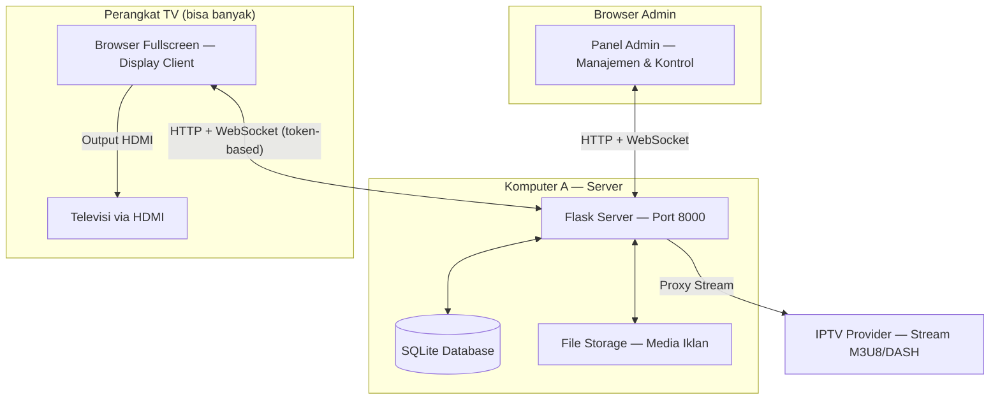
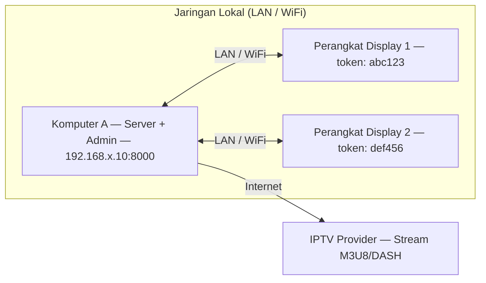
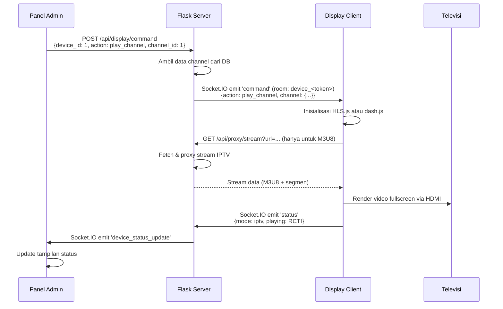
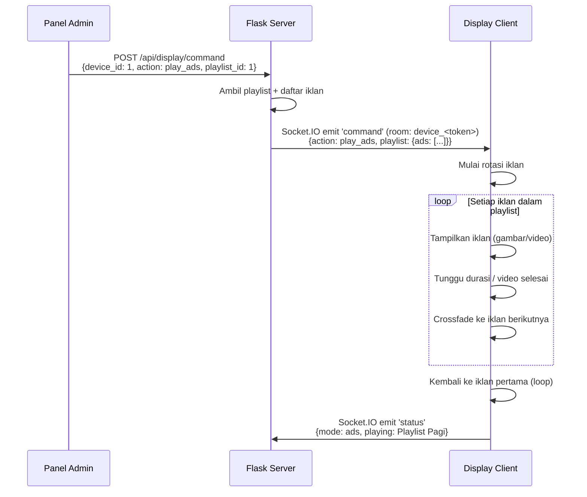
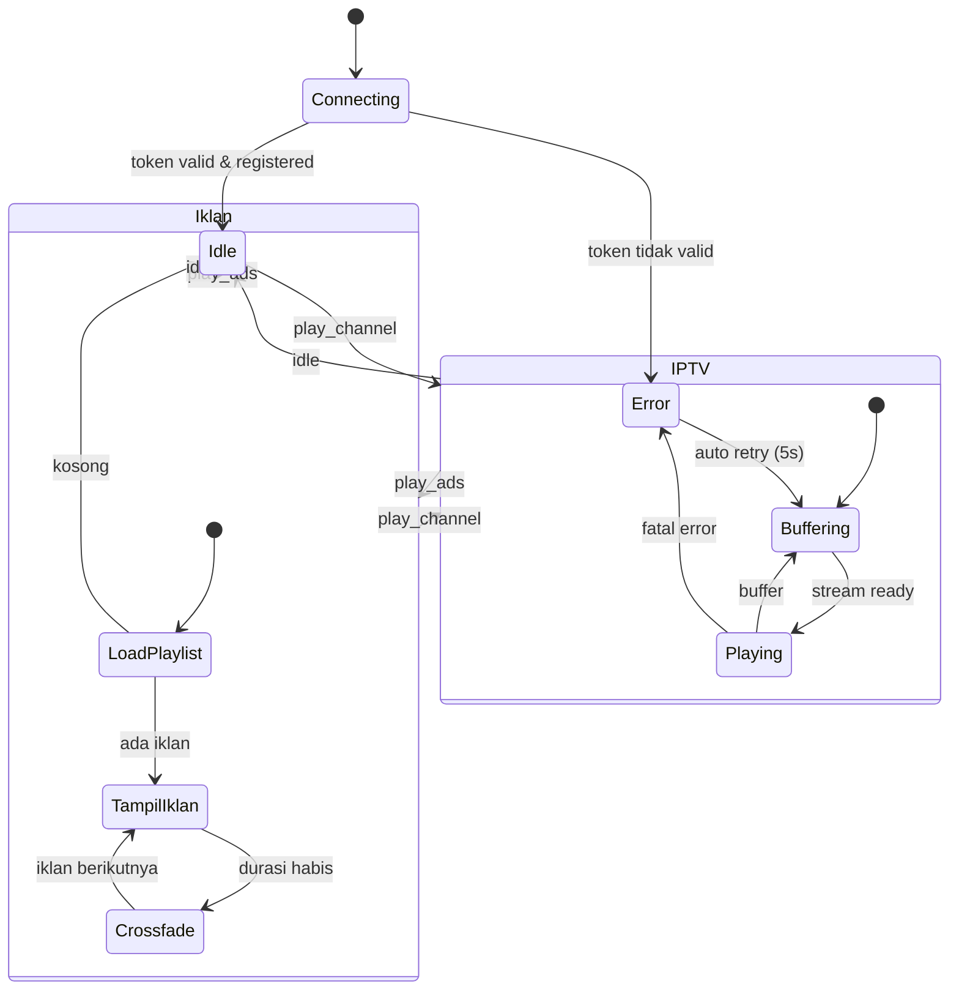
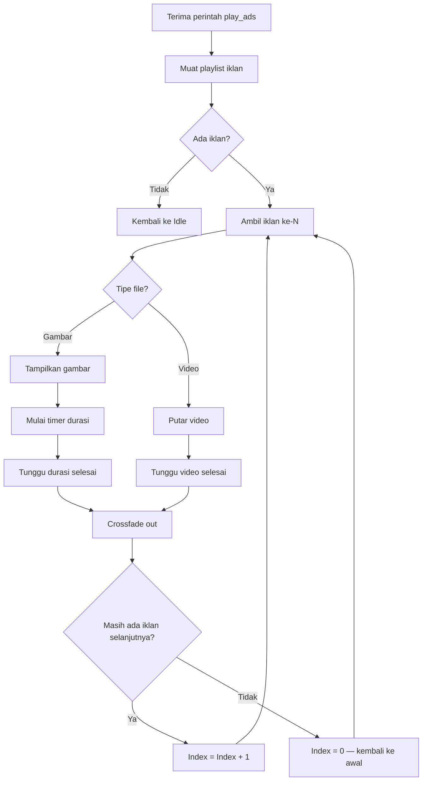

# TV Control — Sistem IPTV & Manajemen Iklan untuk Televisi

Sistem kontrol televisi berbasis web yang memungkinkan sebuah komputer (Komputer A) mengontrol tayangan pada televisi biasa melalui koneksi HDMI. Mendukung streaming IPTV (HLS/M3U8 dan MPEG-DASH) dan penayangan iklan (gambar/video) secara otomatis dengan kontrol penuh dari panel admin yang dilindungi autentikasi.

---

## Daftar Isi

- [Arsitektur Sistem](#arsitektur-sistem)
- [Topologi Jaringan](#topologi-jaringan)
- [Kebutuhan Sistem](#kebutuhan-sistem)
- [Fitur](#fitur)
- [Role & Pengguna](#role--pengguna)
- [Login & Akun](#login--akun)
- [Instalasi](#instalasi)
- [Penggunaan](#penggunaan)
- [Alur Kerja Sistem](#alur-kerja-sistem)
- [Diagram State Display](#diagram-state-display)
- [Alur Rotasi Iklan](#alur-rotasi-iklan)
- [Struktur Proyek](#struktur-proyek)
- [API Reference](#api-reference)
- [Troubleshooting](#troubleshooting)

---

## Arsitektur Sistem

Sistem terdiri dari tiga komponen utama yang berkomunikasi melalui jaringan lokal:



### Komponen

| Komponen | Deskripsi |
|----------|-----------|
| **Flask Server** | Backend Python yang menangani API, WebSocket, manajemen database, dan proxy stream IPTV. Berjalan di Komputer A pada port 8000. |
| **Panel Admin** | Antarmuka web dengan autentikasi untuk mengelola perangkat TV, channel IPTV, upload iklan, membuat playlist, dan mengontrol tayangan TV secara real-time. |
| **Display Client** | Halaman web fullscreen yang berjalan di browser perangkat yang terhubung ke TV via HDMI. Mendaftar ke server menggunakan token unik per perangkat. |
| **SQLite Database** | Menyimpan data admin, perangkat, channel, iklan, dan playlist. File database otomatis dibuat saat pertama kali dijalankan. |
| **File Storage** | Direktori `static/uploads/ads/` dan `static/uploads/channels/` untuk menyimpan file media. |

### Teknologi

| Layer | Teknologi |
|-------|-----------|
| Backend | Python 3.10+, Flask, Flask-SQLAlchemy, Flask-SocketIO (threading mode) |
| Frontend | HTML5, CSS3, JavaScript (Vanilla), Font Awesome 6 |
| Video Streaming | HLS.js (stream M3U8/HLS), dash.js (stream MPEG-DASH/.mpd), HTML5 Video API |
| Real-time | Socket.IO (WebSocket dengan fallback polling), namespace `/display` dan `/admin` |
| Database | SQLite 3 |
| Auth | Session-based, werkzeug password hashing, persistent secret key |

---

## Topologi Jaringan



**Catatan:** Komputer A dan perangkat display harus berada dalam satu jaringan lokal yang sama. Setiap perangkat TV diidentifikasi dengan token unik yang digenerate otomatis.

### Opsi Perangkat Display

| Perangkat | Keterangan |
|-----------|------------|
| **Raspberry Pi 4/5** | Pilihan paling hemat. Jalankan Chromium dalam kiosk mode. |
| **Mini PC (Intel NUC, dsb)** | Performa lebih baik untuk video HD. |
| **Komputer A sendiri** | Jika TV terhubung langsung ke Komputer A via HDMI, buka `/display?token=<token>` di browser kedua. |
| **Android TV Box** | Jika tersedia browser modern, bisa digunakan langsung. |

---

## Kebutuhan Sistem

### Perangkat Keras

- 1x atau lebih Televisi dengan input HDMI
- 1x Komputer A (server, bisa PC/laptop apapun)
- 1x atau lebih perangkat display dengan output HDMI
- Kabel HDMI
- Jaringan lokal (LAN/WiFi)
- Koneksi internet (untuk IPTV)

### Perangkat Lunak

- Python 3.10 atau lebih baru
- pip (Python package manager)
- Browser modern (Chrome/Chromium direkomendasikan untuk display)
- Git (opsional)

---

## Fitur

### Panel Admin

- **Autentikasi** — Setup akun admin pada fresh install, login/logout, sesi 30 hari. Tidak ada registrasi ulang setelah admin dibuat.
- **Manajemen Pengguna** — Admin dapat membuat akun pengguna dengan dua role: `admin` (akses penuh) dan `user` (hanya dashboard & upload iklan). Admin bisa mengubah username, password, role, dan menghapus akun pengguna.
- **Dashboard** — Ringkasan statistik (perangkat, channel, iklan, playlist) dan status display secara real-time. Role `user` tidak melihat bagian Aksi Cepat.
- **Manajemen Perangkat TV** — Tambah perangkat, generate token unik, assign channel dan playlist per perangkat *(khusus admin)*
- **Manajemen Channel IPTV** — Tambah manual, upload file video lokal, atau import dari file/URL M3U *(khusus admin)*
- **Manajemen Iklan** — Upload gambar (PNG, JPG, GIF, WEBP) dan video (MP4, WEBM, MOV) hingga 500MB. Role `user` hanya dapat meng-upload; edit, hapus, dan toggle aktif hanya untuk admin.
- **Playlist Iklan** — Buat playlist dengan urutan iklan yang dapat diatur *(khusus admin)*
- **Kontrol TV** — Kirim perintah per perangkat (mode Idle/IPTV/Iklan, ganti channel, ganti playlist, atur volume) *(khusus admin)*
- **Pengaturan** — Kustomisasi warna admin panel (accent, background, card, teks, sukses, peringatan, bahaya) dan konfigurasi tampilan idle display (teks label, gradasi background, visibilitas jam/tanggal/ikon) *(khusus admin)*
- **Responsive & Scrollable** — Dapat diakses dari desktop maupun mobile; konten panjang dapat di-scroll

### Display Client

- **Registrasi Token** — Setiap display mendaftar ke server dengan token unik (`/display?token=<token>`)
- **Mode Idle** — Tampilan jam dan status koneksi
- **Mode IPTV** — Streaming channel HLS (M3U8) via HLS.js atau MPEG-DASH (.mpd) via dash.js, dengan overlay info channel
- **Mode Iklan** — Rotasi otomatis gambar dan video dengan transisi crossfade
- **Auto-reconnect** — Koneksi ulang otomatis jika terputus
- **Fullscreen** — Double-click untuk toggle fullscreen

---

## Role & Pengguna

Sistem mendukung dua role akun:

| Role | Akses |
|------|-------|
| **admin** | Akses penuh ke semua fitur: perangkat, channel, iklan, playlist, kontrol TV, dan manajemen pengguna |
| **user** | Hanya dashboard (tanpa Aksi Cepat) dan halaman Iklan (upload saja — tidak bisa edit, hapus, atau mengubah status aktif) |

### Akun Pertama (Setup Awal)

Akun pertama yang dibuat saat fresh install selalu mendapat role **admin**.

### Menambah Pengguna

Setelah login sebagai admin, buka menu **Pengguna** di sidebar → **Tambah Pengguna**. Isi username (minimal 3 karakter), password (minimal 8 karakter), dan pilih role. Admin yang menentukan kredensial lalu memberikannya ke pengguna yang bersangkutan.

### Catatan Database

File database (`tvads.db`) tidak ikut disimpan di repository. Setiap mesin yang menjalankan aplikasi memiliki database sendiri dan perlu melakukan **Setup Awal** secara terpisah.

### Keamanan

Semua pembatasan role diterapkan di sisi server (bukan hanya tampilan UI):

- Endpoint yang hanya boleh diakses admin akan mengembalikan `403 Forbidden` jika dipanggil oleh role `user`, meskipun melalui API langsung
- Admin tidak dapat menghapus atau menurunkan role akunnya sendiri
- Sistem selalu memastikan ada minimal satu akun dengan role `admin`

---

## Login & Akun

Tidak ada akun bawaan. Setiap mesin menjalankan database sendiri dan perlu setup awal.

### Fresh Install

Saat pertama kali dijalankan, buka `http://localhost:8000/` — aplikasi otomatis mengarahkan ke halaman **Setup Awal**:

| Field | Ketentuan |
|-------|-----------|
| Username | Minimal 3 karakter |
| Password | Minimal 8 karakter |
| Role | Otomatis `admin` (tidak dapat diubah di sini) |

Setelah setup selesai, halaman ini tidak bisa diakses lagi selama sudah ada akun admin.

### Menambah Akun User

Login sebagai admin → menu **Pengguna** → **Tambah Pengguna**. Admin menentukan username, password, dan role (`admin` atau `user`). Kredensial diberikan secara manual kepada pengguna yang bersangkutan.

### Akses Login

URL login: `http://<IP-server>:8000/login`

| Role | Halaman yang dapat diakses |
|------|---------------------------|
| `admin` | Dashboard, Perangkat TV, Channel IPTV, Iklan (full), Playlist, Kontrol TV, Pengguna, Pengaturan |
| `user` | Dashboard (tanpa Aksi Cepat), Iklan (upload saja) |

---

## Instalasi

### Windows

> Persyaratan: Python 3.10+ sudah terinstall dan tersedia di PATH. Unduh dari [python.org](https://www.python.org/downloads/) — saat instalasi centang **"Add Python to PATH"**.

**1. Clone repository**

```cmd
git clone <repository-url>
cd Television-Ads
```

Jika tidak memiliki Git, unduh ZIP dari halaman repository lalu ekstrak dan masuk ke foldernya.

**2. Install dependencies**

```cmd
pip install -r requirements.txt
```

**3. Jalankan server**

```cmd
python app.py
```

**4. Akses aplikasi**

Buka `http://localhost:8000/` di browser. Pada fresh install, Anda akan diarahkan ke halaman **Setup Awal** untuk membuat akun admin.

> **Catatan:** Jika `pip` tidak dikenali, coba `python -m pip install -r requirements.txt`. Jika port 8000 sudah terpakai, lihat bagian [Troubleshooting](#troubleshooting).

---

### Linux

> Persyaratan: Python 3.10+ dan pip tersedia. Sebagian besar distro modern sudah menyertakannya.

**1. Pastikan Python dan pip tersedia**

```bash
python3 --version
pip3 --version
```

Jika pip belum ada, install dengan:

```bash
# Ubuntu/Debian
sudo apt update && sudo apt install python3-pip

# Fedora/RHEL
sudo dnf install python3-pip

# Arch Linux
sudo pacman -S python-pip
```

**2. Clone repository**

```bash
git clone <repository-url>
cd Television-Ads
```

**3. Install dependencies**

```bash
pip3 install -r requirements.txt
```

**4. Jalankan server**

```bash
python3 app.py
```

**5. Akses aplikasi**

Buka `http://localhost:8000/` di browser. Pada fresh install, Anda akan diarahkan ke halaman **Setup Awal** untuk membuat akun admin.

> **Catatan:** Jika mendapat error `externally-managed-environment` pada Ubuntu 23.04+, tambahkan flag `--break-system-packages`: `pip3 install --break-system-packages -r requirements.txt` — atau gunakan virtualenv.

---

### macOS

> Persyaratan: Python 3.10+. macOS tidak menyertakan Python 3 secara default — install via [python.org](https://www.python.org/downloads/) atau Homebrew.

**1. Install Python (jika belum ada)**

```bash
# Via Homebrew (direkomendasikan)
brew install python

# Verifikasi
python3 --version
```

**2. Clone repository**

```bash
git clone <repository-url>
cd Television-Ads
```

**3. Install dependencies**

```bash
pip3 install -r requirements.txt
```

**4. Jalankan server**

```bash
python3 app.py
```

**5. Akses aplikasi**

Buka `http://localhost:8000/` di browser. Pada fresh install, Anda akan diarahkan ke halaman **Setup Awal** untuk membuat akun admin.

> **Catatan:** Jika mendapat peringatan `externally-managed-environment`, tambahkan flag `--break-system-packages`: `pip3 install --break-system-packages -r requirements.txt` — atau gunakan virtualenv.

---

### Langkah Selanjutnya (Semua Platform)

**Tambahkan Perangkat TV**

Di panel admin, buka menu **Perangkat TV** → **Tambah Perangkat**. Isi nama dan lokasi. Token unik akan digenerate otomatis. Salin token tersebut untuk URL display.

**Akses Display**

Buka URL berikut di browser perangkat yang terhubung ke TV via HDMI:

```
http://<IP-Komputer-A>:8000/display?token=<token-perangkat>
```

Tekan F11 untuk masuk fullscreen.

---

### Setup Display di Raspberry Pi (Opsional)

```bash
# Install Chromium jika belum ada
sudo apt install chromium-browser

# Jalankan dalam kiosk mode
chromium-browser --kiosk --noerrdialogs --disable-infobars \
  --disable-translate --no-first-run \
  "http://<IP-Komputer-A>:8000/display?token=<token>"
```

---

## Penggunaan

### 1. Tambahkan Channel IPTV

Buka menu **Channel IPTV** di panel admin. Ada tiga cara:

- **Manual:** Klik "Tambah Channel", isi nama, URL stream (M3U8/DASH), dan grup
- **Upload Lokal:** Upload file video (MP4, WEBM, dll) sebagai channel lokal
- **Import M3U:** Klik "Import M3U", masukkan URL playlist M3U atau paste isinya

### 2. Upload Iklan

Buka menu **Iklan**, klik "Upload Iklan". Seret file gambar atau video ke area upload. Atur nama dan durasi tampil (untuk gambar).

### 3. Buat Playlist Iklan

Buka menu **Playlist**, buat playlist baru, lalu tambahkan iklan ke dalamnya. Atur urutan dengan tombol panah.

### 4. Assign Channel & Playlist ke Perangkat

Buka menu **Perangkat TV**, klik **Assign Channel** atau **Assign Playlist** pada kartu perangkat yang diinginkan. Centang channel/playlist yang ingin tersedia di perangkat tersebut.

### 5. Kontrol TV

Buka menu **Kontrol TV**, pilih perangkat dari daftar:

- Pilih mode **IPTV** lalu klik channel yang diinginkan
- Pilih mode **Iklan** lalu klik playlist yang ingin ditayangkan
- Pilih mode **Idle** untuk standby
- Atur **volume** dengan slider

---

## Alur Kerja Sistem

### Skenario: Admin Memutar Channel IPTV



### Skenario: Admin Memutar Playlist Iklan



---

## Diagram State Display



---

## Alur Rotasi Iklan



---

## Struktur Proyek

```
Television-Ads/
├── app.py                  # Aplikasi Flask utama (routes, API, Socket.IO, auth)
├── config.py               # Konfigurasi aplikasi (secret key, upload, DB)
├── models.py               # Model database (AdminUser, Channel, Ad, Playlist, Device, AppConfig, ...)
├── requirements.txt        # Dependensi Python
├── list_iptv.txt           # Daftar channel IPTV Indonesia (format M3U)
├── .secret_key             # Secret key sesi (digenerate otomatis, jangan di-commit)
├── tvads.db                # Database SQLite (digenerate otomatis)
├── README.md               # Dokumentasi
├── static/
│   ├── css/
│   │   ├── admin.css       # Stylesheet panel admin
│   │   └── display.css     # Stylesheet display client
│   ├── js/
│   │   ├── admin.js        # JavaScript panel admin (shared utilities)
│   │   └── display.js      # JavaScript display client (player, socket, token)
│   └── uploads/
│       ├── ads/            # File media iklan
│       │   └── .gitkeep
│       └── channels/       # File video channel lokal
│           └── .gitkeep
└── templates/
    ├── base.html           # Template dasar admin (sidebar, topbar, logout)
    ├── login.html          # Halaman login admin
    ├── setup.html          # Halaman setup akun admin (fresh install)
    ├── dashboard.html      # Halaman dashboard
    ├── devices.html        # Halaman manajemen perangkat TV
    ├── channels.html       # Halaman manajemen channel
    ├── ads.html            # Halaman manajemen iklan
    ├── playlists.html      # Halaman manajemen playlist
    ├── control.html        # Halaman kontrol TV per perangkat
    ├── users.html          # Halaman manajemen pengguna (admin only)
    ├── settings.html       # Halaman pengaturan warna & idle display (admin only)
    └── display.html        # Halaman display client (untuk TV)
```

---

## API Reference

### Auth

| Method | Endpoint | Deskripsi |
|--------|----------|-----------|
| GET/POST | `/setup` | Setup akun admin (hanya tersedia saat belum ada admin) |
| GET/POST | `/login` | Login admin |
| POST | `/logout` | Logout admin |

> Semua endpoint `/admin/*` dan `/api/*` (kecuali `/api/proxy/stream`) memerlukan sesi login yang valid.

### Channel

| Method | Endpoint | Deskripsi |
|--------|----------|-----------|
| GET | `/api/channels` | Ambil semua channel |
| POST | `/api/channels` | Tambah channel baru (JSON: name, url, logo_url, group) |
| PUT | `/api/channels/<id>` | Update channel |
| DELETE | `/api/channels/<id>` | Hapus channel |
| POST | `/api/channels/upload` | Upload file video sebagai channel lokal (multipart) |
| POST | `/api/channels/import` | Import dari M3U (JSON: url atau text) |

### Iklan

| Method | Endpoint | Deskripsi |
|--------|----------|-----------|
| GET | `/api/ads` | Ambil semua iklan |
| POST | `/api/ads` | Upload iklan baru (multipart form) |
| PUT | `/api/ads/<id>` | Update nama/durasi/status iklan |
| DELETE | `/api/ads/<id>` | Hapus iklan (file + record) |

### Playlist

| Method | Endpoint | Deskripsi |
|--------|----------|-----------|
| GET | `/api/playlists` | Ambil semua playlist beserta item |
| POST | `/api/playlists` | Buat playlist baru |
| PUT | `/api/playlists/<id>` | Update nama/status playlist |
| DELETE | `/api/playlists/<id>` | Hapus playlist dan semua item-nya |
| POST | `/api/playlists/<id>/items` | Tambah iklan ke playlist |
| DELETE | `/api/playlists/<id>/items/<item_id>` | Hapus item dari playlist |
| PUT | `/api/playlists/<id>/items/reorder` | Ubah urutan item |

### Perangkat TV

| Method | Endpoint | Deskripsi |
|--------|----------|-----------|
| GET | `/api/devices` | Ambil semua perangkat |
| POST | `/api/devices` | Buat perangkat baru (JSON: name, location) |
| GET | `/api/devices/<id>` | Detail perangkat beserta assignment channel & playlist |
| PUT | `/api/devices/<id>` | Update nama/lokasi/status perangkat |
| DELETE | `/api/devices/<id>` | Hapus perangkat |
| POST | `/api/devices/<id>/token` | Generate ulang token perangkat |
| PUT | `/api/devices/<id>/channels` | Set daftar channel yang di-assign (JSON: channel_ids) |
| PUT | `/api/devices/<id>/playlists` | Set daftar playlist yang di-assign (JSON: playlist_ids) |

### Display Control

| Method | Endpoint | Deskripsi |
|--------|----------|-----------|
| POST | `/api/display/command` | Kirim perintah ke perangkat tertentu |
| GET | `/api/display/status` | Cek status semua display terhubung |

**Perintah yang didukung** (body JSON untuk `/api/display/command`):

```json
{ "device_id": 1, "action": "play_channel", "channel_id": 1 }
{ "device_id": 1, "action": "play_ads", "playlist_id": 1 }
{ "device_id": 1, "action": "idle" }
{ "device_id": 1, "action": "set_volume", "volume": 80 }
```

### Konfigurasi Aplikasi

| Method | Endpoint | Deskripsi |
|--------|----------|-----------|
| GET | `/api/config` | Ambil semua konfigurasi (admin only) |
| POST | `/api/config` | Update satu atau lebih key konfigurasi (admin only) |
| GET | `/api/config/css` | CSS variabel warna untuk admin panel (tanpa auth) |
| GET | `/api/config/display` | Konfigurasi idle display untuk display client (tanpa auth) |

**Key konfigurasi yang tersedia:**

| Key | Default | Keterangan |
|-----|---------|------------|
| `color_accent` | `#4c7bf5` | Warna aksen utama |
| `color_accent_hover` | `#6390ff` | Warna aksen saat hover |
| `color_success` | `#2dd4a0` | Warna sukses |
| `color_warning` | `#f5a623` | Warna peringatan |
| `color_danger` | `#f56565` | Warna bahaya/hapus |
| `color_bg_primary` | `#0b0e14` | Background utama |
| `color_bg_secondary` | `#111520` | Background sidebar |
| `color_bg_card` | `#161b28` | Background card |
| `color_text_primary` | `#e6e9f0` | Warna teks utama |
| `idle_show_clock` | `true` | Tampilkan jam di idle |
| `idle_show_date` | `true` | Tampilkan tanggal di idle |
| `idle_show_icon` | `true` | Tampilkan ikon di idle |
| `idle_label` | `TV Control System` | Teks label di idle |
| `idle_bg_from` | `#0a1628` | Warna gradasi atas idle background |
| `idle_bg_to` | `#050a14` | Warna gradasi bawah idle background |

### Stream Proxy

| Method | Endpoint | Deskripsi |
|--------|----------|-----------|
| GET | `/api/proxy/stream?url=<url>` | Proxy stream M3U8 IPTV (bypass CORS, rewrite segment URLs). Tidak memerlukan login. MPEG-DASH stream tidak diproxy — diakses langsung oleh dash.js. |

### Socket.IO Events

**Namespace `/display`** (display client):

| Event | Arah | Payload | Deskripsi |
|-------|------|---------|-----------|
| `register` | client → server | `{token}` | Daftarkan display dengan token |
| `registered` | server → client | `{device_id, name, location}` | Konfirmasi registrasi berhasil |
| `auth_error` | server → client | `{message}` | Token tidak valid |
| `command` | server → client | `{action, ...}` | Perintah kontrol (play_channel, play_ads, idle, set_volume) |
| `status` | client → server | `{mode, playing}` | Laporan status display |

**Namespace `/admin`** (panel admin):

| Event | Arah | Payload | Deskripsi |
|-------|------|---------|-----------|
| `display_update` | server → client | `{count, displays}` | Update jumlah & daftar display terhubung |
| `device_status_update` | server → client | `{token, device_id, mode, playing}` | Update status perangkat tertentu |

---

## Troubleshooting

### Stream IPTV tidak muncul

- Pastikan URL stream valid dan dapat diakses dari Komputer A
- Format M3U8 (HLS) diproxy oleh server untuk mengatasi CORS. Format MPEG-DASH (.mpd) diakses langsung oleh dash.js — pastikan server IPTV mengizinkan CORS atau gunakan browser yang tidak memblokir
- Beberapa provider memblokir berdasarkan User-Agent atau IP

### Display tidak terhubung / pesan "Token tidak valid"

- Pastikan URL display menyertakan token yang benar: `http://<IP>:8000/display?token=<token>`
- Token dapat dilihat dan di-regenerate di halaman **Perangkat TV**
- Pastikan perangkat berstatus aktif di panel admin

### Display tidak menerima perintah

- Pastikan display sudah terhubung (indikator hijau di pojok kanan bawah)
- Pastikan channel/playlist sudah di-assign ke perangkat tersebut
- Cek status real-time di halaman **Kontrol TV**

### Iklan tidak tampil

- Pastikan file iklan berhasil diupload (cek di halaman Iklan)
- Pastikan iklan berstatus aktif (toggle hijau)
- Pastikan playlist berisi minimal satu iklan aktif dan sudah di-assign ke perangkat

### Port 8000 sudah digunakan

Edit baris terakhir `app.py`:

```python
socketio.run(app, host='0.0.0.0', port=8000, ...)
# Ganti 8000 dengan port lain, misalnya 8080
```

### macOS: Error `OSError: [Errno 57] Socket is not connected`

Error ini disebabkan oleh macOS hairpin TCP — koneksi dari IP sendiri ke IP sendiri melalui interface fisik. Solusinya:

- Dari Komputer A, akses server melalui `localhost:8000`, bukan via IP
- Perangkat lain di jaringan tetap menggunakan IP Komputer A seperti biasa
- Error ini sudah di-suppress di `app.py` dan tidak mempengaruhi fungsionalitas

### Port 5000 digunakan AirPlay (macOS)

macOS menggunakan port 5000 untuk AirPlay Receiver. Aplikasi ini sudah dikonfigurasi untuk berjalan di port **8000** untuk menghindari konflik ini.

---

## Lisensi

MIT License
